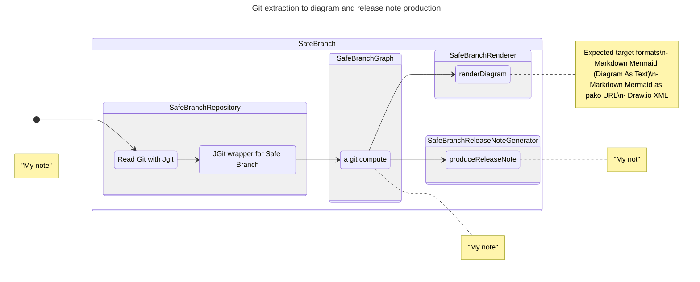

# SAFE BRANCH
## A Git visualizer with release note generation

@author : Régis CHEVREL - rchevrel.net

## Big Picture

```mermaid
---
title: "Git extraction to diagram and release note production"
---
stateDiagram-v2
    direction LR
    state SafeBranch {
        state SafeBranchRepository {
            readGit : Read Git with Jgit
            wrapGit : JGit wrapper for Safe Branch
        }
        note left of SafeBranchRepository : "My note"
        state SafeBranchGraph {
            direction TB
            computeGitTree : a git compute
            %% createDiagram
            note right of computeGitTree : "My note"
        }
        state SafeBranchRenderer {
            renderDiagram
            note right of renderDiagram : Expected target formats\n- Markdown Mermaid (Diagram As Text)\n- Markdown Mermaid as pako URL\n- Draw.io XML
        }
        state SafeBranchReleaseNoteGenerator {
            produceReleaseNote
            note right of produceReleaseNote : "My not"
        }
    }
    [*] --> readGit
    readGit --> wrapGit
    wrapGit --> computeGitTree
    %% computeGitTree --> createDiagram
    computeGitTree --> produceReleaseNote
    computeGitTree --> renderDiagram
```

## Architecture

> TODO

## Tests

> TODO

