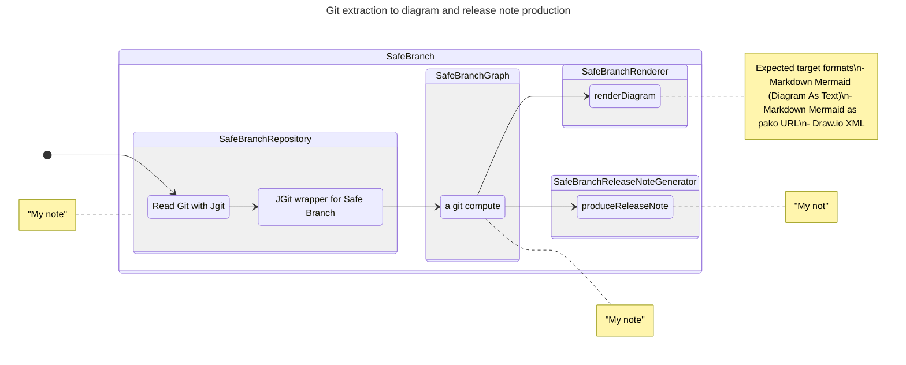
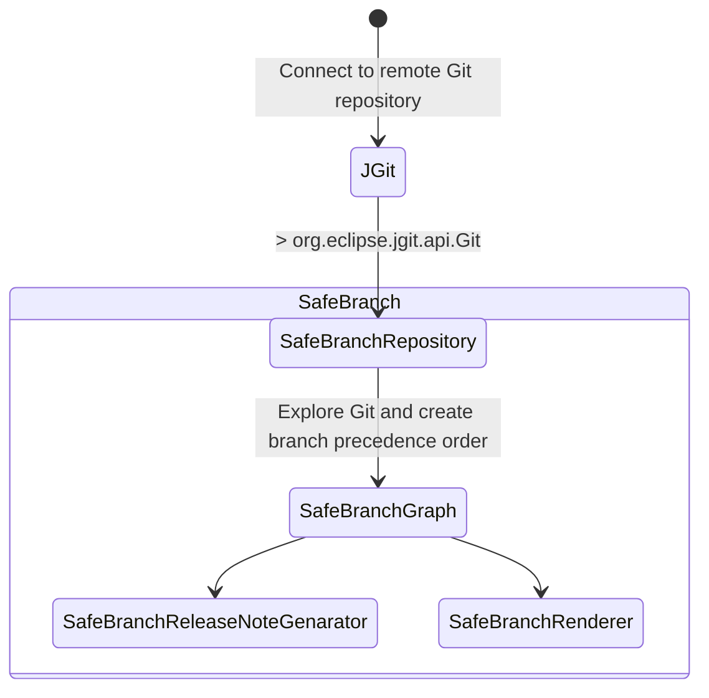
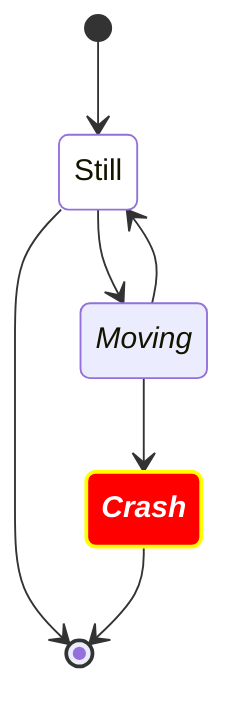
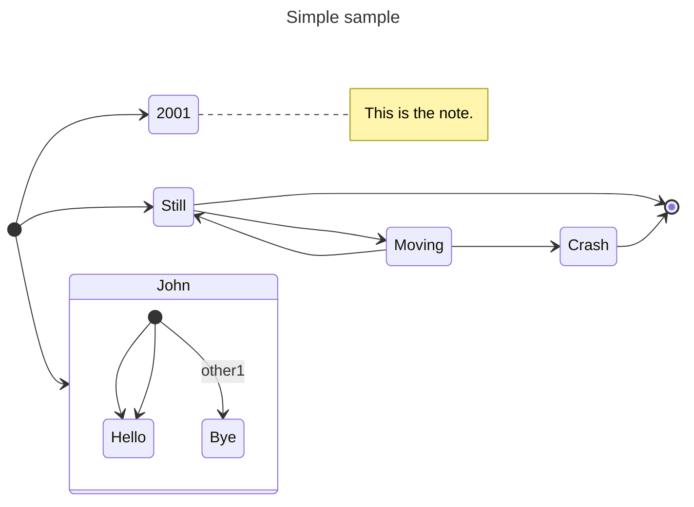
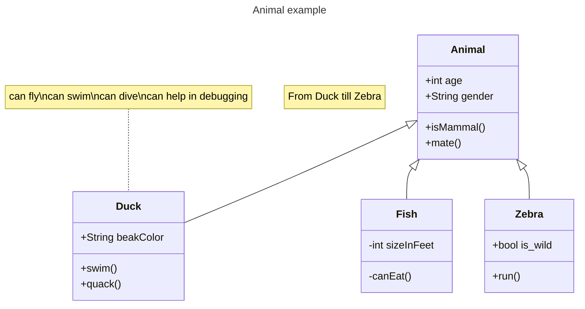

# SAFE BRANCH
## A Git visualizer with release note generation

@author : Régis CHEVREL - rchevrel.net

## Big Picture

> *diagram generated with Safe Brach (rchevrel.net/SafeBranch)*

Diagram

## Architecture

## Tests
