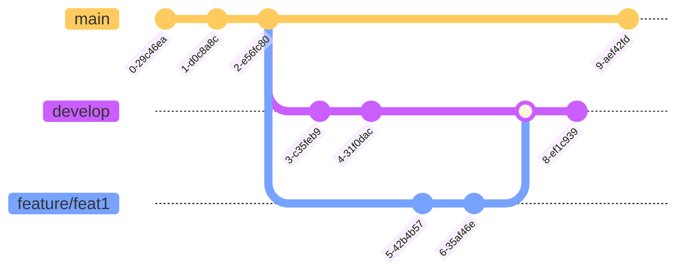
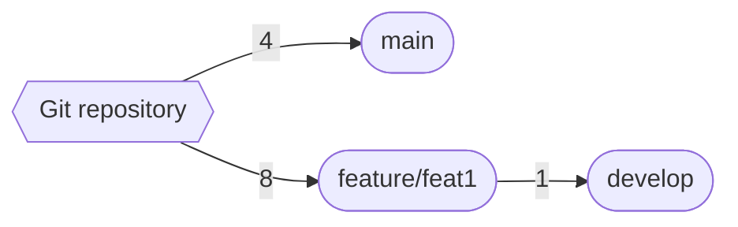

# Case 1

## Input git

```mermaid
%%{init: { 'logLevel': 'debug', 'theme': 'base', 'gitGraph': {'showBranches': true,'showCommitLabel': true}} }%%
gitGraph
    commit
    commit
    commit
    branch develop
    checkout develop
    commit
    commit
    checkout main
    branch feature/feat1
    commit
    commit
    checkout develop
    merge feature/feat1
    commit
    checkout main
    commit
```

## Expected SafeBranch GitView

```mermaid
flowchart LR
    repo{{Git repository}}
    main([main])
    develop([develop])
    feat1([feature/feat1])
    repo -- "&nbsp;4&nbsp;"--> main
    repo -- 8 --> feat1
    feat1 -- 1 -->develop
```
